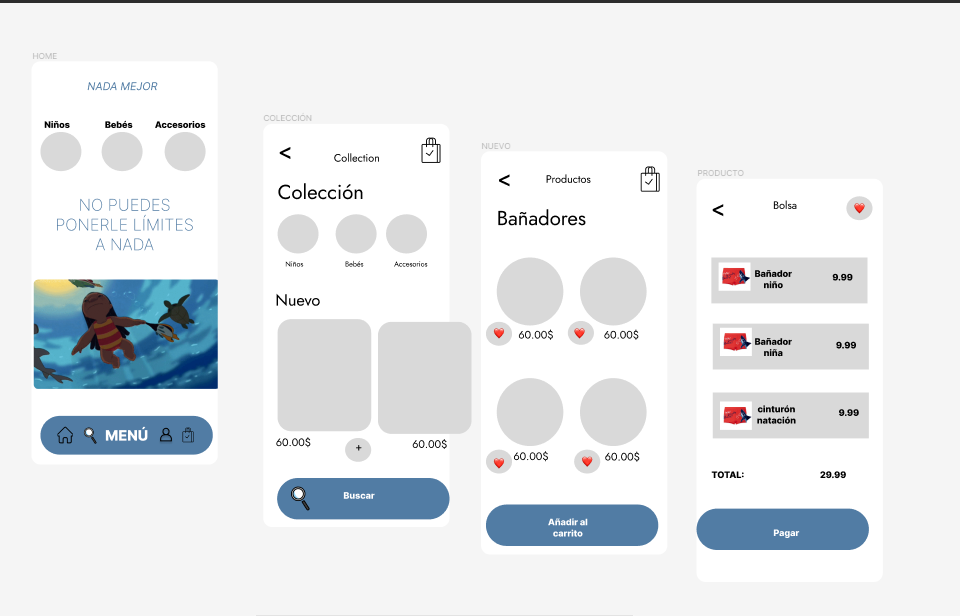
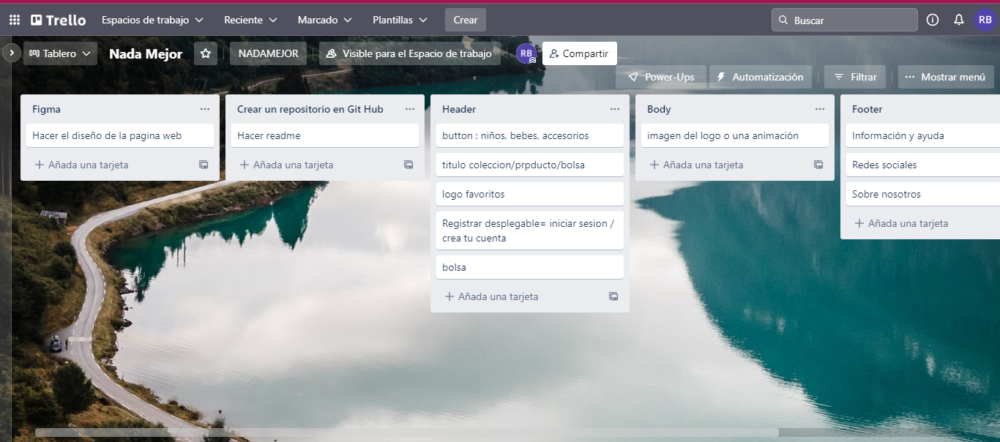

 # NADA MEJOR 

# TABLA DE CONTENIDOS
### 1. Información general
### 2. Capturas de pantalla
### 3. Tecnologías
### 4. Instalación
### 5. Soporte
### 6. Hoja de ruta
### 7. Autora

# INFORMACIÓN GENERAL
Nada mejor es un proyecto personal pensado y creado para el publico infantil.
Es una tienda online para vender ropa y accesorios de piscina.
 
Proyecto en proceso de desarrollo.

# CAPTURAS DE PANTALLA 

https://www.figma.com/file/YISKqm3Io7dbgSh7KHernO/Untitled?node-id=0%3A1

https://trello.com/b/hJ3ucItb/nada-mejor

# TECNOLOGÍAS

### -HTML: Version HTML 5
### -CSS: Version CSS3
### -Json-Server
### -React

# INSTALACIÓN

1. Ingresar en Visual Studio Code
2. Clonar el proyecto con el comando:
git clone https://github.com/RosaaBecerra/nadamejor2.git

En Visual Studio Code instalar:
-React.js
-React-router-dom

# SOPORTE

Si tiene alguna duda o problema contacte con:
rosabecerra143@gmail.com

# HOJA DE RUTA

En la primera entrega presento la aplicación movil en donde muestra enmaquetada la primera y segunda página.
En la próxima actualización se mostrará responsive, un carrito de compras que incluya PayPal y tarjetas de crédito como métodos de pago.
Posibilidad de registrarse como cliente.
Posibilidad de abonarse a la Newsletter.
Que la tienda online este conectada con las redes sociales: Facebook, Instagram,Twiter.
Que todos los iconos hagan su función.

# AUTORA
Rosa Estela Becerra Medina

